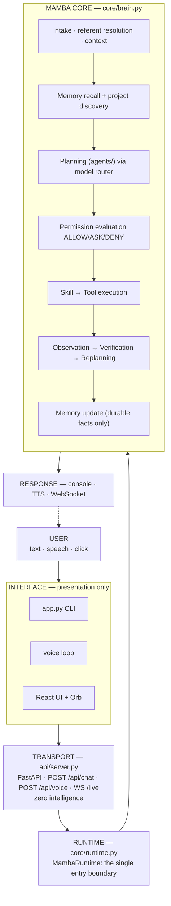
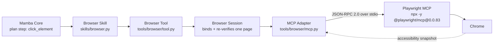

<div align="center">

# 🐍 Mamba

### The Personal AI Operating Layer

[](https://www.python.org/downloads/)
[](#-platform-support)
[](docs/ARCHITECTURE.md)
[](docs/SECURITY.md)

**Mamba is not a chatbot with tool plugins. It is the layer that decides what an AI is
allowed to do on your machine — and then does it.**

State a goal in text or speech. Mamba resolves what you meant, recalls what it knows,
plans concrete steps, **checks each one against a permission policy before running it**,
executes real tools, observes the actual output, verifies the outcome really happened,
replans when it didn't, remembers what's durable, and answers — in writing or out loud.

</div>

---

## Contents

- [Why Mamba exists](#why-mamba-exists)
- [What it actually does](#what-it-actually-does)
- [How it is built](#how-it-is-built)
- [The one security idea](#the-one-security-idea)
- [Quick start](#quick-start)
- [Running Mamba](#running-mamba)
- [Capabilities](#capabilities)
- [Browser automation, in detail](#browser-automation-in-detail)
- [Web search vs browser automation](#web-search-vs-browser-automation)
- [Voice](#voice)
- [Memory](#memory)
- [Desktop and cross-app control](#desktop-and-cross-app-control)
- [Project understanding](#project-understanding)
- [Models and routing](#models-and-routing)
- [Permissions in practice](#permissions-in-practice)
- [Desktop shell](#desktop-shell)
- [Configuration reference](#configuration-reference)
- [Repository layout](#repository-layout)
- [Testing](#testing)
- [Troubleshooting](#troubleshooting)
- [Known limitations](#known-limitations)
- [Roadmap](#roadmap)
- [Glossary](#glossary)
- [Documentation](#documentation)
- [Platform support](#platform-support)
- [License](#license)

---

## Why Mamba exists

Most "agent" frameworks are a loop: ask a model for a tool call, run it, repeat. That works
for a demo and falls apart on a real desktop, where a wrong tool call deletes a folder, sends
an email, or clicks *Purchase*.

Mamba is built around three commitments:

1. **The model proposes. Mamba disposes.** Nothing a model outputs can grant itself
   permission, downgrade a risk classification, or declare its own result verified.
2. **Verify, don't assume.** A step is done when the *observation* says so and a predicate
   confirms it — not when the model claims it. `INCONCLUSIVE` is a real answer.
3. **Bounded, not infinite.** One observation-driven loop, max 10 reasoning cycles, with
   identical-plan detection. A confused model cannot burn your machine indefinitely.

---

## What it actually does

| | |
| :--- | :--- |
| **Works on your files** | read, write, create directories, delete (to OS trash) |
| **Runs commands** | direct-exec with per-command risk classification — and *no shell*: `cmd`/`powershell`/`bash` are refused by design |
| **Drives a real browser** | navigate, read the accessibility tree, click elements, type, scroll, select — never by pixel coordinates |
| **Controls Windows apps** | launch Notepad / Calculator / File Explorer / VS Code, bind the exact window, type where the app declares a text field, read the result back |
| **Sees the screen** | full/region screenshots, OCR, vision-model screen description |
| **Searches the web** | live results via Tavily, with sources |
| **Inspects GitHub** | repos, files, issues, PRs, code search (read-only) |
| **Handles communication flows** | email / calendar / messaging with real approval gates — currently on simulated providers |
| **Remembers you** | local SQLite + on-device embeddings, with conflict supersession |
| **Talks and listens** | Whisper STT, Aura-1 TTS, continuous conversation, VAD, barge-in, offline "hey mamba" wake word |
| **Knows your codebase** | automatic project discovery + git context on every request |
| **Lives on your desktop** | Electron shell, floating Orb, tray, `Ctrl+Space`, dormant-first backend |

---

## How it is built

One brain. Every interface is presentation or plumbing.



Hard boundaries, enforced by the code and documented in
[docs/ARCHITECTURE.md](docs/ARCHITECTURE.md) §23:

- **Core** owns planning, permissions, execution, verification, and memory.
- **`api/server.py`** forwards and formats. It is not a second brain.
- **Electron** owns windows, tray, hotkey, Orb, wake-word hosting, and backend process
  lifecycle. It plans nothing.
- **React** renders state and captures input. No orchestration.
- The **Orb** is a visualization that also happens to hold the microphone for wake detection.

---

## The one security idea

```
planner / model ──► "delete the file, it's fine, approved"     ← a PROPOSAL
        │
        ▼
  ingress sanitisation ──► security fields discarded + logged  ← Mamba
        │
        ▼
  capability metadata ──► authoritative risk + sensitivity     ← Mamba
        │
        ▼
  permission policy ──► LOW/MEDIUM allow · HIGH ask · CRITICAL deny
        │
        ▼
  user approval ──► recorded by Core against a Core-generated step id
```

**A plan describes intent. It is never a credential.** Approval is a fact about *you*, held by
Core, bound to one specific step — so approving one destructive action does not authorize the
next, and a spoken "yes" cannot satisfy a HIGH-risk pause at all.

Full specification, the 15 architectural invariants, and the residual risks that are *not*
yet closed: **[docs/SECURITY.md](docs/SECURITY.md)**.

---

## Quick start

### Prerequisites

| Requirement | Needed for |
| :--- | :--- |
| **Python 3.11+** | everything (uses `StrEnum`, so 3.11 is a hard floor) |
| **At least one** of `NVIDIA_API_KEY`, `GROQ_API_KEY`, `GEMINI_API_KEY` | planning and analysis — startup fails without one |
| **Node.js 18+** (provides `npx`) | the desktop shell **and** browser automation |
| Tesseract OCR engine | screen OCR only — everything else works without it |
| Windows | desktop/window/clipboard control (see [Platform support](#platform-support)) |

### Install

```powershell
git clone https://github.com/omkarmusle510-web/MAMBA-AI.git
cd MAMBA-AI

python -m venv .venv
.\.venv\Scripts\Activate.ps1

pip install -r requirements.txt

# Recommended, not required:
pip install python-dotenv          # so a .env file is loaded automatically
pip install sentence-transformers  # so memory uses semantic search, not just keywords
npm install                        # only for the Electron desktop app
```

> `python-dotenv` and `sentence-transformers` are not in `requirements.txt`. Without the
> first, set your keys as real environment variables; without the second, memory still works
> via its keyword fallback.

### Configure

```powershell
Copy-Item .env.example .env
notepad .env
```

```env
# At least one is required:
NVIDIA_API_KEY=nvapi-...
GROQ_API_KEY=gsk_...
GEMINI_API_KEY=...

# Optional capabilities
TAVILY_API_KEY=tvly-...        # live web search
GITHUB_TOKEN=ghp_...           # higher rate limits, private repos
CLOUDFLARE_ACCOUNT_ID=...      # voice output
CLOUDFLARE_API_TOKEN=...       # voice output
```

`.env` is read at process start when `python-dotenv` is installed; the Tavily key is read
from the process environment only, so an exported variable always works.

### Run

```powershell
python app.py "What framework is this project using, and is the tree clean?"
```

```text
  ⟩ Understanding...
  ⟩ Planning...
  ⟩ Executing...

[Status: completed]
This is a FastAPI + React/Electron project … Git: branch 'main' (dirty) …
```

---

## Running Mamba

| Mode | Command | Notes |
| :--- | :--- | :--- |
| Interactive text | `python app.py` | `mamba>` prompt; type `voice` to switch |
| One-shot | `python app.py "<goal>"` | arguments are joined into one request |
| Voice (CLI) | `python app.py --voice` | Enter to start/stop recording; needs `GROQ_API_KEY` |
| Transport only | `python app.py --server` | FastAPI on `http://127.0.0.1:8000` (`MAMBA_PORT` to change) |
| Desktop app | `npm run build` then `npm run electron` | Orb, tray, hotkey, continuous voice |
| Dev (Vite + backend) | `npm run electron:dev` | uses a live Vite server |

Transport surface (a **transport adapter**, not an orchestrator):

| Endpoint | Purpose |
| :--- | :--- |
| `GET /health` | liveness, used by the Electron backend manager |
| `POST /api/chat` | `{"input": "…"}` → `{status, output, awaiting_approval, reason, execution_id}` |
| `POST /api/voice` | multipart audio → transcribe + execute (no server-side playback) |
| `WS /live` | in: `text`, `audio` (base64 WAV), `video` (ack) · out: `transcription`, `progress`, `status`, `permission_request`, `audio`, `turnComplete`, `error` |
| `GET/POST /api/settings`, `/api/reminders` | UI preferences and reminders in `.mamba/` |

An approval is answered on `/live` as an ordinary `text` message (`"yes"` / `"no"`) — the same
intake path as everything else, which is why no client can smuggle authority.

---

## Capabilities

**14 capabilities** are registered in `core/capabilities.py`, and the planner is only shown
what is actually registered — Mamba does not hallucinate a tool it does not have. Full action
lists, authoritative risk values, and known gaps: **[docs/SKILLS.md](docs/SKILLS.md)**.

| Capability | Representative actions | Gate | Status |
| :--- | :--- | :--- | :--- |
| `filesystem` | read/write/create/list · **delete** | delete = **ASK** | IMPLEMENTED |
| `terminal` | `run_command` (direct-exec, no shell) | destructive = **ASK** | IMPLEMENTED |
| `desktop` | open URL/app, windows, clipboard, cross-app type/read | mostly ALLOW | IMPLEMENTED |
| `browser` | navigate, inspect, click, type, scroll, select | consequential clicks = **ASK** | IMPLEMENTED |
| `system` | `system_info`, `gpu_info` | read-only | IMPLEMENTED |
| `screen` | `screenshot`, `ocr`, `visual_understanding` | read-only (needs Tesseract / a vision model) | IMPLEMENTED |
| `web` | `web_search` (Tavily) | ALLOW | IMPLEMENTED · key-gated |
| `github` | repo/file/issue/PR/code search | ALLOW, read-only | IMPLEMENTED |
| `memory` | `remember`, `recall`, `delete_memory` | ALLOW | IMPLEMENTED |
| `email` | search/read/draft · **send/reply** | send/reply = **ASK** | IMPLEMENTED (simulated provider) |
| `calendar` | list/conflicts/create/modify/cancel | mutating = **ASK** | IMPLEMENTED (simulated provider) |
| `messaging` | read/draft · **send/reply** | send/reply = **ASK** | IMPLEMENTED (simulated provider) |
| `analyze` | analyze/calculate/summarize/respond | ALLOW | IMPLEMENTED |
| `project_understanding` | project info/architecture/problems/files/git | read-only | IMPLEMENTED |

> **Email, Calendar and Messaging use built-in simulated providers** with sample inboxes and
> calendars. The intents, skills, permission gates, and verification receipts are real and
> fully exercised; **no real mailbox is connected, so nothing can actually be sent.** Real
> provider integration is [planned](#roadmap).

Status labels used across the docs: **IMPLEMENTED** · **IMPLEMENTED-HARDENING** · **PLANNED**
· **DEFERRED**.

---

## Browser automation, in detail

The chain is explicit — each layer has one job:



What that buys you:

- **Element references, never coordinates.** Mamba reads the page as an accessibility
  snapshot, resolves `click`/`type` targets by ref (falling back to role/name/text), and
  **refuses** to act on zero or ambiguous matches.
- **Headless by default.** `MAMBA_BROWSER_HEADLESS=0` shows the window;
  `MAMBA_BROWSER_PROVIDER=playwright` swaps the MCP layer for the direct Playwright library;
  `MAMBA_BROWSER_CDP_ENDPOINT` attaches to a Chrome you already started.
- **Consequential actions ask.** A click, type, key press, or select that can submit, post,
  send, purchase, delete, or change account state is escalated to HIGH → approval, using the
  same permission system as everything else.
- **It is honest about what it cannot do.** It controls one bound page at a time; it cannot
  drive a page whose target element it cannot identify, and it does not fight over your normal
  browsing session unless you point it at a CDP endpoint.

Requirements: Node.js on `PATH`. The dependency is checked when the first browser action
runs, not at startup.

---

## Web search vs browser automation

These are separate capabilities and people conflate them constantly:

| | `web` | `browser` |
| :--- | :--- | :--- |
| Answers | *"what is out there?"* | *"do something on this page"* |
| Behind it | one Tavily HTTPS call | Playwright MCP → Chrome |
| State | none | a bound page across steps |
| Risk | LOW, read-only | MEDIUM → HIGH when consequential |
| Needs Node.js | no | yes |

---

## Voice

```
mic ──► Groq Whisper STT ──► MambaRuntime ──► normalization ──► Cloudflare Aura-1 TTS ──► speaker
```

- **CLI**: `python app.py --voice`; Enter starts and stops recording.
- **Desktop**: a **continuous** conversation — one microphone acquisition, energy-based VAD to
  segment turns (1.2 s of silence ends one, 20 s caps one), and **barge-in**: talking over
  Mamba stops playback and starts a new turn. Quiet sessions self-end after ~5 minutes.
- **Wake word**: **"hey mamba"**, offline, using sherpa-onnx keyword spotting that runs in the
  Electron main process (pinned Apache-2.0 model). Working prototype: one phrase, one English
  model, accuracy and power cost unmeasured.
- **TTS is not streamed** — the provider returns a complete clip and Mamba plays a complete
  clip rather than faking a stream. On Cloudflare quota (HTTP 429) the session degrades to
  text-only audio and keeps working.
- **Voice cannot approve a risky action.** The prompt arrives on screen and by speech; the
  answer must be a click or typed word.

Details, thresholds, and limitations: **[docs/VOICE_INTERFACE.md](docs/VOICE_INTERFACE.md)**.

---

## Memory

Local SQLite (`.mamba/memory.db`) with on-device `all-MiniLM-L6-v2` embeddings and a keyword
fallback that activates automatically if the model isn't installed. Memories are typed
(`user_preference`, `user_fact`, `project_context`, `project_decision`, `task_context`,
`knowledge`, `conversation_summary`), carry importance, and **supersede** rather than
contradict: *"my name is Alice"* → *"my name is Bob"* retires the old entry with a link.

Retrieval runs before every plan; only durable outcomes are written back — directory listings,
file reads, screenshots, and search dumps are filtered out, and secrets are refused at capture
even if storage is forced. Embeddings never leave the machine.

**[docs/MEMORY.md](docs/MEMORY.md)**

---

## Desktop and cross-app control

Cross-application interaction is **generic and registry-driven**, not Notepad-specific: adding
an application is one declarative record, not new execution logic.

| Application | Launch | Type | Read back | Observed via |
| :--- | :---: | :---: | :---: | :--- |
| Notepad | ✓ | ✓ | ✓ | Win32 text control |
| Calculator | ✓ | — | display | native Ctrl+C → clipboard probe |
| File Explorer | ✓ (a folder) | — | — | window state |
| VS Code | ✓ | — | — | window state only |

Safety by construction: a window is a target only if it positively identifies itself (process
name + window class + title pattern), re-checked immediately before the first keystroke; apps
that declare no text field refuse typing; and where nothing can observe the result, Mamba says
**"executed but not independently verified"** instead of claiming success.

---

## Project understanding

Ask *"what is this project?"*, *"explain its architecture"*, *"are there problems?"*, *"which
files matter for auth?"*, *"what's the git status?"*.

Discovery also runs **automatically on every request**, so the planner always knows which repo
it is in. `find_problems` is static and evidence-based — merge-conflict markers, unreadable
files, Python syntax errors, missing tests — with severities (`CONFIRMED` /
`POSSIBLE_CONCERN`). It never runs your tests, edits your code, or touches git state.

**[docs/PROJECT_UNDERSTANDING.md](docs/PROJECT_UNDERSTANDING.md)**

---

## Models and routing

`models/router.py` is deterministic and capability-aware: explicit provider → explicit model →
explicit capability → multimodal compatibility → available providers → stable order. An
unsatisfiable explicit requirement **fails honestly** instead of quietly substituting a model
that can't do the job. Providers are stdlib-HTTP only; no SDK lock-in; at least one must be
configured.

| Provider | Default model | Notes |
| :--- | :--- | :--- |
| **NVIDIA NIM** | `nvidia/nemotron-3-super-120b-a12b` | OpenAI-compatible; vision `meta/llama-3.2-11b-vision-instruct` (`NVIDIA_VISION_MODEL`) |
| **Groq** | `qwen/qwen3.8-27b` (`GROQ_MODEL`) | also hosts Whisper STT (`GROQ_STT_MODEL`) |
| **Google Gemini** | `gemini-2.5-flash` (`GEMINI_MODEL`) | multimodal; accepts `GOOGLE_API_KEY` |
| Cloudflare Workers AI | `@cf/deepgram/aura-1` | TTS only |

---

## Permissions in practice

| Risk | Decision | Example |
| :--- | :--- | :--- |
| `LOW` | ALLOW | `read_file`, `system_info`, `screenshot`, `web_search` |
| `MEDIUM` | ALLOW | `write_file`, `git commit`, typing into an app, page navigation |
| `HIGH` | **ASK** | `delete`, `rm`/`format`, `git push --force`, `send_email`, `cancel_event`, a browser click that submits |
| `CRITICAL` | DENY | reserved; escalation with `destructive`/`irreversible` can reach it |

Sensitivity flags (`destructive`, `irreversible`, `user_sensitive`, `externally_visible`) come
from the capability's own table and can only make a decision **stricter**. You see the pause as
`[Confirmation Required]` in the CLI, or as a popup (plus a spoken notice) on desktop; answer
`yes`, `no`, or *"no, instead …"* to swap the target.

---

## Desktop shell

- **Floating Orb** — frameless, always-on-top, bottom-right; three.js shader presence that
  mirrors live state (`idle`, `listening`, `thinking`, `speaking`, `permission`, `error`).
  Click to activate; drag anywhere.
- **Main window** — the full React chat + voice interface.
- **Tray** — Show / Hide / Quit. **Global hotkey** — `Ctrl+Space` from anywhere.
- **Dormant-first lifecycle** — `DORMANT → STARTING → ACTIVE → IDLE → SHUTTING_DOWN`. The
  Python backend is *not* running when you're not using Mamba; it starts on demand and shuts
  down after 10 minutes idle (5-minute grace), and will never kill a running task, a pending
  permission, or an active voice session. The shell only terminates backends it started.
- Nothing in the shell plans, routes models, or executes tools.

---

## Configuration reference

| Variable | Default | Purpose |
| :--- | :--- | :--- |
| `NVIDIA_API_KEY` / `GROQ_API_KEY` / `GEMINI_API_KEY` | — | model providers (≥1 required) |
| `GROQ_MODEL` / `GEMINI_MODEL` | see table above | text model overrides (the NVIDIA model is set in code — `app.py` builds that provider with no env override) |
| `NVIDIA_VISION_MODEL` | `meta/llama-3.2-11b-vision-instruct` | screen visual understanding |
| `TAVILY_API_KEY` | — | web search (capability reports `NOT_CONFIGURED` without it) |
| `GITHUB_TOKEN` | — | authenticated GitHub reads, higher rate limits |
| `CLOUDFLARE_ACCOUNT_ID` / `CLOUDFLARE_API_TOKEN` | — | TTS |
| `CLOUDFLARE_TTS_MODEL` | `@cf/deepgram/aura-1` | TTS override |
| `GROQ_STT_MODEL` | `whisper-large-v3-turbo` | STT override |
| `TESSERACT_PATH` | auto-detected | explicit path to the Tesseract OCR binary |
| `MAMBA_PORT` | `8000` | transport port (loopback only) |
| `MAMBA_MEMORY_DB` | `.mamba/memory.db` | memory database location |
| `MAMBA_BROWSER_PROVIDER` | `playwright-mcp` | `playwright` uses the direct library |
| `MAMBA_BROWSER_HEADLESS` | `1` | `0` shows the browser window |
| `MAMBA_BROWSER_ISOLATED` | `1` | throwaway profile (ignored with a user data dir) |
| `MAMBA_BROWSER_CDP_ENDPOINT` | — | attach to an existing Chrome |
| `MAMBA_BROWSER_USER_DATA_DIR` | — | persistent profile |
| `MAMBA_BROWSER_PACKAGE` | `@playwright/mcp@0.0.83` | MCP server override |
| `MAMBA_BROWSER_ACTION_TIMEOUT` | `180` | per browser call deadline (seconds) |
| `MAMBA_IDLE_TIMEOUT_MS` | `600000` | shell idle window before IDLE |
| `MAMBA_IDLE_SHUTDOWN_TIMEOUT_MS` | `300000` | grace period before backend shutdown |
| `MAMBA_REAL_DESKTOP_TESTS` | — | set `1` to run tests that drive real windows |

---

## Repository layout

```
app.py ............. CLI / voice / --server, and create_runtime(): the only wiring point
api/ ............... FastAPI transport adapter
core/ .............. runtime.py (boundary) · brain.py (lifecycle) · capabilities.py (registry)
                     · project.py (discovery) · context/state/types
agents/ ............ planning_agent.py · planner.py      (legacy: registry.py, tools/, server.py)
models/ ............ router.py · providers/{nvidia,groq,gemini}
skills/ ............ one reusable capability each + mixed.py (intent routing)
tools/ ............. filesystem · terminal · desktop · system · screen · web · browser · github
                     · email · calendar · messaging
permissions/ ....... DefaultPermissionPolicy (ALLOW/ASK/DENY)
verification/ ...... DefaultVerifier (predicates over observations)
memory/ ............ SQLite store · manager · embeddings · retrieval
voice/ ............. VoiceInterface · STT · TTS · audio · normalization
tasks/ ............. TaskExecutor / TaskHandler contracts
electron/ .......... shell: main · backend · frontend · lifecycle · tray · hotkey · preload
                     · static server · wakeKws (wake-word service) · sherpa/
src/ ............... React UI: MambaApp · FloatingOrb · orb shaders · audio session (VAD,
                     barge-in) · wake engines · settings
public/wake/ ....... pinned offline KWS models + VERSIONS.md
tests/ ............. 16 files (pytest)
docs/ .............. ARCHITECTURE · SECURITY · SKILLS · MEMORY · VOICE_INTERFACE
                     · PROJECT_UNDERSTANDING
.mamba/ ............ runtime data: memory.db · settings.json · reminders.json (gitignored)
```

---

## Testing

```powershell
pytest tests/ -v
```

| Suite | Covers |
| :--- | :--- |
| `test_core_lifecycle.py` | request → response through Brain |
| `test_planner_trust_boundary.py` | the security boundary: 13 tests proving model output cannot self-authorize |
| `test_permission_and_continuation.py` | ASK pause, approval, resume, denial |
| `test_compound_workflow.py`, `test_reliability_hardening.py` | multi-step recovery, loop prevention, failure handling |
| `test_capability_registry.py` | grounding and availability |
| `test_browser_capability.py` | browser intent → action resolution |
| `test_cross_app_capability.py`, `test_cross_app_notepad.py` | adapter registry, target binding; real windows opt in with `MAMBA_REAL_DESKTOP_TESTS=1` |
| `test_memory_v2.py` | store, supersession, retrieval |
| `test_model_router.py` | routing and provider fallback |
| `test_planning_agent.py` | JSON plan parsing and validation |
| `test_api_server.py` | transport adapter + WebSocket |
| `test_communication_productivity.py` | email/calendar/messaging flows and gates |
| `test_project_understanding.py` | discovery and git context |
| `test_voice.py` | STT/TTS providers and the voice loop |

The frontend type-checks and builds with `npm run build` (`tsc && vite build`).

---

## Troubleshooting

| Symptom | Cause | Fix |
| :--- | :--- | :--- |
| `RuntimeError: at least one model provider …` | no provider key | set one of `NVIDIA_API_KEY` / `GROQ_API_KEY` / `GEMINI_API_KEY` |
| `.env` values ignored | `python-dotenv` not installed | `pip install python-dotenv`, or export the variables |
| `web` says not configured | no `TAVILY_API_KEY` | add a key — this is correct behavior, not a bug |
| `browser_unavailable` on the first browser action | `npx` not on PATH | install Node.js 18+ |
| Browser never appears | it runs headless by default | `MAMBA_BROWSER_HEADLESS=0` |
| Memory results feel literal | embedding model missing | `pip install sentence-transformers` |
| OCR unavailable | Tesseract not installed | install the Windows build (other capabilities unaffected) |
| Voice errors at startup | missing `GROQ_API_KEY` / Cloudflare keys | text mode works regardless |
| TTS stops mid-session | Cloudflare quota (429) | expected: it degrades to text and continues |
| Desktop app shows nothing | frontend not built | `npm run build`, then `npm run electron` |

---

## Known limitations

Stated because a project that drives your machine should not oversell itself.

- **Simulated communication.** Email/calendar/messaging run on sample-data providers; the
  gates and flows are real, the mailbox is not.
- **Not a sandbox.** Mamba runs with *your* permissions. The policy gates risk; it does not
  contain privilege. There is no container, restricted token, or job object.
- **Loopback only, unauthenticated.** The transport binds `127.0.0.1` with permissive CORS and
  no auth. Anything that can reach that port can ask Mamba to act.
- **Prompt injection is mitigated, not solved.** Approval gates and verification limit what a
  malicious page or file can achieve through the model, but observations fed back into
  planning carry no provenance label yet.
- **Shell-free terminal by design.** No interpreted pipelines; chained shell syntax is one
  argument to one executable.
- **Uncatalogued handlers default LOW.** Every shipped handler declares its own risk, and the
  registry is the coverage surface; a handler that declared nothing would execute silently.
  Fail-closed defaults are planned.
- **Wake word is a prototype.** One phrase, one English model, unmeasured false-accept rate
  and idle power draw, diagnostic logging still in the path.
- **Reminders have no scheduler.** They are stored and displayed; nothing fires them.
- **Perceived latency.** Model calls are one blocking HTTPS round-trip each, MCP browser
  timeouts are measured between stdout lines rather than enforced mid-read, project discovery
  and memory writes run inline. Working correctly, slower than it should be.
- **Legacy code is still in the tree.** `agents/registry.py`, `agents/tools/`, `agents/server.py`
  and two root TypeScript files are unreferenced. Documented as dead, not deleted.

---

## Roadmap

**Planned** — designed, no code path executes it:

- Real Gmail / Google Calendar / chat providers behind the existing gates.
- Reminder scheduling and delivery.
- Fail-closed risk defaults for handlers without metadata; content provenance on observations.
- Browser provider health probe at startup; enforced MCP call timeouts.
- Multi-phrase wake word with verified accuracy and a power budget.

**Deferred** — deliberately out of scope:

- Packaged distribution (installer, auto-update, code signing).
- Remote/mobile access and authenticated transport.
- Multi-user or team workspaces.
- Sandboxed tool execution.

---

## Glossary

The vocabulary Mamba's code and docs use consistently:

| Term | Meaning in this repository |
| :--- | :--- |
| **Request** | `UserRequest` — a goal plus metadata; the unit of intake. |
| **Context** | `ExecutionContext` — one run's state: request, plan, observations, history. |
| **Plan** | `ExecutionPlan` — the ordered steps the planner produced for this cycle. |
| **Plan Step** | `PlanStep{description, intent, metadata}` — one proposed action. Its `id` is generated by Core and is what approval binds to. |
| **Task** | The executor's unit of work: a plan step handed to a handler (`tasks/`). |
| **Skill** | One reusable capability (`skills/`); maps intents, supplies authoritative metadata. |
| **Tool** | The thing that touches the outside world (`tools/`); validates, executes, returns. |
| **Agent** | A model-backed reasoner. Today: `PlanningAgent` (via `AgentPlanner`). |
| **Model** | An LLM endpoint used for planning and analysis. |
| **Provider** | The vendor adapter behind a model (NVIDIA / Groq / Gemini / Cloudflare / Groq-Whisper). |
| **Capability** | A registry entry (`core/capabilities.py`) declaring actions, limits, provider, and availability. |
| **Permission** | `PermissionDecision` — ALLOW / ASK / DENY from `RiskLevel` + sensitivity flags. |
| **Approval** | The user's recorded "yes" for one specific step id. Held by Core; not a metadata field. |
| **Observation** | What a step actually produced (`Observation{content, success, metadata}`). |
| **Verification** | `VERIFIED` / `FAILED` / `INCONCLUSIVE` — predicates over observations. |
| **Memory** | A durable entry in the local store, typed and superseded rather than duplicated. |
| **Response** | `ExecutionResult{status, output, observations}` rendered as text, speech, or UI. |

---

## Documentation

| Document | Read it for |
| :--- | :--- |
| **[ARCHITECTURE.md](docs/ARCHITECTURE.md)** | the full system specification: lifecycle, orchestration, skills/tools, models, permissions, verification, memory, transport, Electron shell, Orb, layer invariants, capability status |
| **[SECURITY.md](docs/SECURITY.md)** | the trust boundary, 15 invariants, approval binding, verification trust, residual risks |
| **[SKILLS.md](docs/SKILLS.md)** | every capability: actions, intent aliases, authoritative risk gates, advertised-vs-reachable gaps |
| **[VOICE_INTERFACE.md](docs/VOICE_INTERFACE.md)** | STT/TTS, continuous conversation, VAD thresholds, barge-in, wake word, voice approval policy |
| **[MEMORY.md](docs/MEMORY.md)** | storage, embeddings and fallback, types, supersession, transient filtering |
| **[PROJECT_UNDERSTANDING.md](docs/PROJECT_UNDERSTANDING.md)** | discovery, problem detection, git context, boundaries |

---

## Platform support

Mamba is built and tested for **Windows 10/11** (x64). Desktop control, cross-application
interaction, window management, clipboard, and audio playback use Win32 APIs (`pywin32`,
`pygetwindow`, `pyautogui`, `pycaw`, MCI playback) and degrade with an explicit "unavailable"
observation elsewhere rather than pretending. The core lifecycle, memory, models, GitHub, web
search, transport, and browser automation are cross-platform. macOS/Linux desktop control is
**not** implemented.

---

## License

The README and metadata have declared **MIT** since the project's first public commit, but no
`LICENSE` file exists in the repository yet, so licensing is formally **undeclared**. Until a
`LICENSE` file is added, treat the intended license as MIT and verify before redistributing.

Created by **Omkar Musale**.

---

<div align="center">

**Mamba** — an operating layer between you and your tools, where the model suggests,
and the system decides.

</div>
