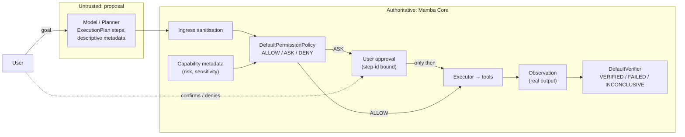
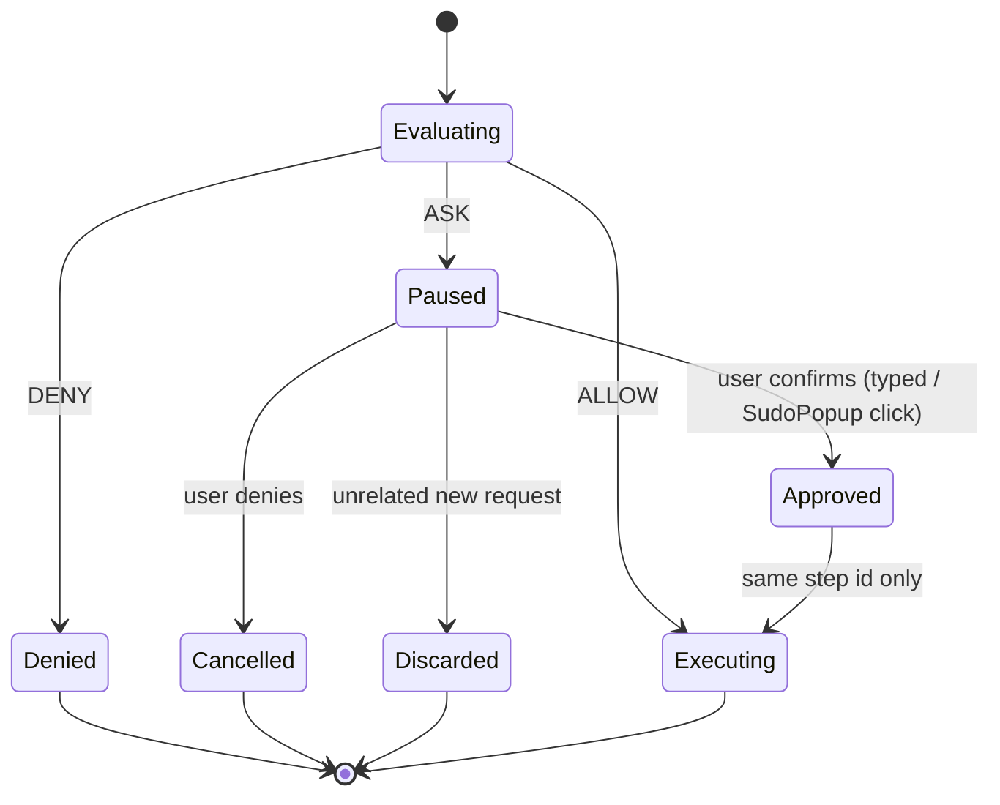

# Mamba Security Model

> **Status: IMPLEMENTED-HARDENING.** The trust boundary, permission policy, approval
> binding, and verification model described here are implemented and covered by
> regression tests (`tests/test_planner_trust_boundary.py`). Residual risks that the
> current architecture does not yet close are listed explicitly in §9 — they are not
> hidden, and they are not "planned" features.

Mamba is a **single-user, local-first** system that drives real tools on a real machine:
it can delete files, run shell commands, type into windows, and control a browser.
Security in Mamba is therefore not about protecting a service from the internet — it is
about making sure that **a language model's guesses can never become an authorized
action**.

---

## 1. The one rule everything else follows

**The model proposes *what* it wants to do. Mamba decides *whether* it may happen.**

A plan step is a description of intent. It is never a credential. Nothing a model
outputs can:

- mark an action approved, authorized, permitted, or bypassed;
- lower the risk classification a capability assigned to itself;
- clear a sensitivity flag a capability set;
- declare an outcome verified, or skip verification.

Those four statements are the security model. Everything below is how they are enforced.

---

## 2. Who holds which authority

| Security decision | Owned by | Never supplied by |
| :--- | :--- | :--- |
| Risk level of an action | Skill/tool handler metadata + capability registry (`get_metadata()`) | Planner/model |
| Sensitivity flags (`destructive`, `irreversible`, `user_sensitive`, `externally_visible`) | Capability table (authoritative `True` only) | Planner/model |
| ALLOW / ASK / DENY | `permissions/policy.py :: DefaultPermissionPolicy` | Any model output |
| Approval of an ASK step | The user, recorded in `Brain._approved_step_ids` keyed by server-generated `PlanStep.id` | Step metadata, request metadata, transcript |
| Whether an outcome happened | `verification/verifier.py :: DefaultVerifier` over the **observed** result | The model's claim about its result |
| Whether a capability may run at all | `CapabilityRegistry` status (`AVAILABLE` / `NOT_CONFIGURED` / `DISABLED` / `UNSUPPORTED`) | Planner's belief that a tool exists |

Two structural properties make this hard to get wrong:

1. **Single choke point.** All model plan output passes through one parse-and-validate
   function (`agents/planning_agent.py :: _validate_and_build_plan`). Security fields are
   discarded there, before Core ever sees them, and the discard is logged.
2. **Single record of approval.** Approval is a fact *about the user*, held by Core, and
   looked up by an identifier that Core generates itself (`PlanStep.id`). Because the
   identifier is not model-authored, it cannot be forged or guessed from model output.

---

## 3. Architectural invariants

These are the rules a change must not break. Each is enforced in code, and the ones with
a direct security consequence are covered by named regression tests.

| # | Invariant |
| :--- | :--- |
| 1 | **Model output is untrusted with respect to security authority.** A plan describes intent; it cannot grant permission. |
| 2 | **Security state has exactly one authoritative source per concern.** Risk and sensitivity come from capability metadata; permission from the policy; approval from the user; verification from observed evidence. |
| 3 | **Claims can only escalate, never de-escalate.** A step that asserts a *higher* risk is honoured; a step that asserts a *lower* risk cannot reduce the capability's own classification. |
| 4 | **Approval is non-transferable and step-scoped.** Approving one destructive step does not authorize any other step, a later step, or a replanned step. |
| 5 | **Approval does not survive an unrelated request.** A pending approval is cleared when the user changes the subject, denies, or replaces the action. |
| 6 | **`EXPECTED OUTCOME ≠ OBSERVED OUTCOME ≠ VERIFIED OUTCOME.** Verification consumes the real observation, never the model's restatement of it, and can return `INCONCLUSIVE`. |
| 7 | **There is one permission system.** `PermissionDecision` / `RiskLevel` is the only gate. No component adds a second approval channel or a bypass flag. |
| 8 | **The transport is plumbing, not authority.** `api/server.py` forwards and formats; it holds no planning, permission, or execution logic. |
| 9 | **Presentation layers cannot authorize.** React and Electron render state and forward input; they never plan, route models, execute tools, or approve actions. |
| 10 | **Consequential actions require a human.** Actions that submit, post, send, purchase, delete, or change account or page state are gated by the policy before execution. |
| 11 | **Voice cannot approve.** A spoken "yes" never satisfies a pending HIGH-risk approval; the user must confirm visually or by typed input. A spoken "no" always cancels — the safe direction. |
| 12 | **Unconfigured capabilities fail honestly.** A capability without a provider produces a clear "not configured" message, not a fabricated result and not a hallucinated tool. |
| 13 | **Unregistered intents do not execute.** A step whose intent resolves to no handler fails with an explicit error rather than falling through to some default action. |
| 14 | **Credentials are never model arguments.** API keys are read from the environment by providers; tokens are redacted from tool errors and logs and cannot be passed as step metadata. |
| 15 | **Execution is bounded.** A max-cycle loop with identical-plan detection means a hostile or looping model output cannot drive unbounded tool invocation. |

---

## 4. Permission model

`DefaultPermissionPolicy` is deterministic:

| Risk level | Base decision |
| :--- | :--- |
| `LOW` | ALLOW |
| `MEDIUM` | ALLOW |
| `HIGH` | ASK |
| `CRITICAL` | DENY |

Sensitivity flags then **raise** the decision, never lower it:

| Flag | Effect at HIGH | Effect at CRITICAL |
| :--- | :--- | :--- |
| `destructive` | ASK | DENY |
| `irreversible` | ASK | ASK |
| `externally_visible` | ASK | ASK |
| `user_sensitive` | ASK | ASK |

Flag values only count when they are exactly `True` and only when they originate from the
capability's own metadata table. `_raise_decision` is monotonic — an escalation can move a
decision toward DENY but can never move it toward ALLOW.

**Not a sandbox.** MEDIUM-risk writes, terminal commands, and desktop actions execute
automatically on the user's machine. The policy gates *risk*, not *privilege*: Mamba runs
with the user's own permissions and does not attempt containment beyond the ASK/DENY gate.
This is a deliberate scope decision, not an oversight — see §9.

---

## 5. Approval lifecycle

- On ASK, Core parks the step as `PendingApproval` (step + context + plan) and returns an
  `awaiting_approval` result. Nothing executes in the interim.
- Approval is recorded against that step's generated id and consumed by the resume path,
  which re-runs only the remaining steps.
- Denial cancels cleanly; replacement forms (`"no, instead …"`, `"make that <file>"`)
  rebind the target and continue.
- Clients see the pause as `awaiting_approval: true` on HTTP or a `permission_request`
  message on `/live`, so any UI can present its own confirmation without becoming an
  authority.

---

## 6. Verification trust

Mamba distinguishes three things that agents routinely conflate:

1. **Expected outcome** — what the plan asked for (`expected` / `verify` metadata, or the
   provider's declared receipt contract).
2. **Observed outcome** — what the tool actually returned, captured as an `Observation`.
3. **Verified outcome** — the result of `DefaultVerifier` comparing the two.

Verdicts are `VERIFIED`, `FAILED`, or `INCONCLUSIVE`. `INCONCLUSIVE` is a first-class
result: when nothing can observe an effect — an application that renders without an
inspectable control, an unavailable value, an insufficient-evidence request — Mamba reports
"executed but not independently verified" instead of success. A failed verification
triggers replanning, so a wrong assumption produces a new plan rather than a false claim.

Predicate families in use: `contains` / `not_contains`, `pattern` / `regex`, `equals`,
`exit_code`, `file_exists` / `file_absent`, `content_matches`, `provider_verified`, and a
non-empty-output check when `verify` is requested without a concrete expectation.

---

## 7. Capability-specific posture

| Area | Posture |
| :--- | :--- |
| **Terminal** | Mutating/high-risk commands gate on declared risk; interactive TUI input is not supported, so Mamba cannot be steered into a shell it cannot observe. |
| **Filesystem** | Deletes go to the OS trash rather than hard-deleting where the platform supports it; destructive writes are flagged. Root-scoped operations are gated by risk. |
| **Browser** | Element-targeted only: navigation and interaction go through the accessibility/structure snapshot, never raw coordinates. Actions that submit, post, purchase, delete, or change account state require approval. |
| **Desktop / cross-app** | Explicit target binding — a window is a target only if it positively identifies as a supported application (process, window class, title pattern), re-verified immediately before input. Applications that do not declare a text field refuse typing. No close/delete/shutdown exists in this layer. |
| **Screen** | Read-only capture and OCR; it cannot click or drive GUI elements. |
| **Email / Calendar / Messaging** | Full permission and verification wiring, currently on **simulated** providers with sample data — so no real message can be sent today. Real provider integration inherits the same ASK gates. |
| **GitHub** | Read-only against the REST API. No commit, push, merge, or issue-write path exists to be misused. |
| **Memory** | Secrets are filtered at capture; embeddings are computed locally, so remembered content never leaves the machine. |

---

## 8. Local trust surface

- The transport binds to **`127.0.0.1`** and is intended for loopback desktop use. CORS is
  permissive because the assumed client is the local Electron shell, not a remote origin.
  **There is no authentication on the HTTP/WebSocket surface.** Anything that can reach
  that port can ask Mamba to act — which is why the backend only runs while the shell is
  active, and why exposing Mamba beyond loopback is listed as *not implemented*.
- `.mamba/` (memory DB, settings, reminders) lives on the local disk with the user's own
  file permissions and is gitignored.
- Model providers are reached over HTTPS with stdlib HTTP; keys come from the environment
  only.

---

## 9. Residual risks (stated, not marketed away)

| Risk | Current mitigation | Not yet closed by |
| :--- | :--- | :--- |
| An intent routed to a handler that declares **no** metadata is classified `LOW` and executes automatically. | Every shipped handler in the mixed registry declares metadata; the registry is the coverage surface. | A fail-closed default for uncatalogued handlers. Adding one changes normal low-risk behavior, so it needs deliberate design, not a patch. |
| Prompt injection via **content Mamba reads** (a web page, a file, OCR) can push the planner toward an action the user did not intend. | Approval gates consequential actions; the planner cannot self-authorize; unconfigured capabilities fail honestly. | Content-origin provenance/trust labels for observations fed back into planning. |
| The loopback API is unauthenticated. | Bound to `127.0.0.1`; dormant-first backend lifecycle. | Per-session tokens or OS-level peer validation. |
| `CRITICAL → DENY` is coarse: there is no per-user or per-project policy, no allow-list memory of past approvals. | Escalation-only rules keep the policy predictable. | Policy profiles / scoped standing approvals (deliberately not added — they widen the attack surface). |
| Model output can still waste cycles or produce nonsense plans. | Bounded cycles, identical-plan detection, failure-observation replanning. | Rate limiting / cost budgets per request. |

---

## 10. Hardening status

| Item | Status |
| :--- | :--- |
| Planner cannot supply approval, risk, sensitivity, or verification verdicts (discarded at ingress, logged) | **IMPLEMENTED-HARDENING** |
| Risk claims can only escalate (`_max_risk_level`) | **IMPLEMENTED-HARDENING** |
| Approval bound to Core-generated step id, cleared on subject change / denial | **IMPLEMENTED-HARDENING** |
| Voice-originated approval rejected for pending HIGH-risk actions | **IMPLEMENTED** |
| Verification reads observations, not model claims; `INCONCLUSIVE` exists | **IMPLEMENTED** |
| Regression suite for the boundary (13 tests) | **IMPLEMENTED-HARDENING** |
| Fail-closed default for handlers that declare no metadata | **PLANNED** |
| Content-provenance labeling for injected observations | **PLANNED** |
| Authenticated / token-guarded transport | **DEFERRED** (loopback-only scope) |
| Sandboxed execution (container, job object, restricted token) | **DEFERRED** (out of scope by design) |

---

## Related documents

- [Architecture Specification](ARCHITECTURE.md) — §8 Permissions, §9 Verification, §23 invariants
- [Skills & Capabilities Reference](SKILLS.md) — per-capability actions and safety gates
- [Long-Term Memory](MEMORY.md) — capture filtering and secret handling
- [Voice Interface Guide](VOICE_INTERFACE.md) — the voice approval policy
