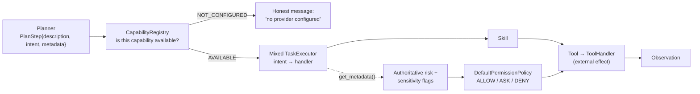

# Mamba Skills & Capabilities Reference

> Generated from the **current source**, not from historical prose. The authoritative
> definitions are:
> - `core/capabilities.py :: default_capability_registry()` — the **14** capability
>   descriptors the planner is allowed to know about
> - `skills/mixed.py :: create_mixed_task_executor()` — the intent → handler routing table
> - each capability's own operation-metadata table (`tools/*/types.py`,
>   `tools/browser/types.py`) — the authoritative risk and sensitivity values

Nothing in this document is a capability Mamba does not have today. Where an action is
advertised but not reachable, or a provider is simulated rather than real, it says so.

**Status labels used throughout:**

| Label | Meaning |
| :--- | :--- |
| **IMPLEMENTED** | Wired end-to-end: planner intent → skill → tool → real effect, covered by tests |
| **IMPLEMENTED-HARDENING** | Implemented, and additionally covered by explicit trust-boundary or safety work |
| **PLANNED** | Designed but not implemented; no code path executes it |
| **DEFERRED** | Deliberately out of scope for the current design |

A capability is only labeled complete when no known blocking limitation applies to it.

---

## 1. How a capability becomes an action

Three rules that explain every table below (full treatment in [SECURITY.md](SECURITY.md)):

1. **The planner names an intent; the capability decides the risk.** Risk levels and
   sensitivity flags in this document come from the operation tables in `tools/`, never
   from model output.
2. **`LOW` and `MEDIUM` execute; `HIGH` asks; `CRITICAL` denies.** A sensitive flag can
   only push a decision stricter.
3. **Unregistered intents do not execute.** An intent that maps to no handler fails with an
   explicit "no handler registered" error.

Intent aliases are deliberately generous (`browse_url`, `go_back`, `fill_field`, …) because
they are what a model naturally emits; only the `intent` values shown in the registry's
`supported_actions` are guaranteed to appear in planner prompts.

---

## 2. Capability index (registry truth)

| # | `capability_id` | Name | Provider | Availability rule | Status |
| :--- | :--- | :--- | :--- | :--- | :--- |
| 1 | `filesystem` | Filesystem & Directories | `local` | always | **IMPLEMENTED** |
| 2 | `terminal` | Terminal | `local` | always | **IMPLEMENTED** |
| 3 | `desktop` | Desktop & Windows | `local` | Windows-only at the tool level | **IMPLEMENTED** |
| 4 | `browser` | Browser Interaction | `playwright-mcp` (or `playwright`) | needs Node.js `npx` at call time | **IMPLEMENTED** |
| 5 | `system` | System Information | `local` | always | **IMPLEMENTED** |
| 6 | `screen` | Screen & Vision | `local` | OCR needs the Tesseract engine | **IMPLEMENTED** |
| 7 | `web` | Web Search | `tavily` | gated on `TAVILY_API_KEY` | **IMPLEMENTED** (key-gated) |
| 8 | `github` | GitHub | `github_api` / `unauthenticated` | token optional (rate limits) | **IMPLEMENTED** (read-only) |
| 9 | `memory` | Long-Term Memory | `sqlite` | always | **IMPLEMENTED** |
| 10 | `email` | Email | `simulated` | registry flag `email_configured` | **IMPLEMENTED** · real provider **PLANNED** |
| 11 | `calendar` | Calendar & Scheduling | `simulated` | registry flag `calendar_configured` | **IMPLEMENTED** · real provider **PLANNED** |
| 12 | `messaging` | Messaging | `simulated` | registry flag `messaging_configured` | **IMPLEMENTED** · real provider **PLANNED** |
| 13 | `analyze` | Analysis & Reasoning | `model_router` | needs ≥1 model provider | **IMPLEMENTED** |
| 14 | `project_understanding` | Project Understanding | `local` | always | **IMPLEMENTED** |

The registry is what grounds the planner: `format_summary_for_planner()` and
`format_system_context()` are injected into planning context, so Mamba plans only with
capabilities it actually has, and reports unconfigured ones as unconfigured instead of
inventing a tool.

---

## 3. Per-capability reference

Risk values below are the authoritative operation-table values. "Gate" is the resulting
policy decision (`ALLOW` executes silently, `ASK` pauses for approval, `DENY` refuses).

### 3.1 `filesystem` — IMPLEMENTED

| Action | Risk | Flags | Gate |
| :--- | :--- | :--- | :--- |
| `read_file` | LOW | — | ALLOW |
| `list_directory` | LOW | — | ALLOW |
| `create_directory` | LOW | — | ALLOW |
| `exists` | LOW | — | ALLOW |
| `write_file` | MEDIUM | — | ALLOW |
| `delete` | HIGH | `destructive`, `irreversible`, `user_sensitive` | **ASK** |

Skills: `ReadFileSkill`, `WriteFileSkill`, `ListDirectorySkill`, `CreateDirectorySkill`,
`DeleteSkill` (`skills/filesystem.py`). Deletions route through `Send2Trash` where the
platform supports it, so a deleted path is recoverable from the OS trash rather than
unlinked. Writes create parent directories as needed. There is no remote-mount or
network-filesystem path.

### 3.2 `terminal` — IMPLEMENTED (and *not* a shell)

| Command class | Risk | Gate |
| :--- | :--- | :--- |
| Read-only system commands (`echo`, `ls`, `dir`, `cat`, `pwd`, `whoami`, `ipconfig`, `date`, …) | LOW | ALLOW |
| Read-only git (`status`, `log`, `diff`, `show`, `branch`, `rev-parse`, …) | LOW | ALLOW |
| Ordinary development commands, git writes (`add`, `commit`, `checkout`, `pull`, `clone`), `git config` writes, `git tag` creation | MEDIUM | ALLOW |
| Destructive commands (`del`, `rm`, `rmdir`, `erase`, `format`, `shred`) | HIGH + `destructive`/`irreversible`/`user_sensitive` | **ASK** |
| `git reset --hard`, `git clean -f`, `git push --force`, `git branch -D`, `git tag -d` | HIGH + `destructive`/`irreversible` | **ASK** |

Classification is per command (`tools/terminal/types.py :: classify_terminal_command`), so
`git status` and `git push --force` are not treated alike.

**Structural constraint worth knowing:** Mamba's terminal capability is
**direct-exec, not shell**. `validate_non_shell_command` rejects `cmd`, `powershell`,
`pwsh`, `bash`, `sh`, `zsh` as executables and rejects shell-mode flags (`/c`, `/k`,
`-command`, and `-c` for non-Python executables). Commands run with an argument list and an
optional `cwd` and `timeout`; stdout, stderr, and exit code are captured as the observation.
So Mamba cannot be asked to "pipe X into Y" — chained shell syntax is a single argument to
one executable, not an interpreted pipeline.

### 3.3 `desktop` — IMPLEMENTED

Registry actions: `open_url`, `open_application`, `close_application`, `focus_window`,
`get_foreground_window`, `get_window_title`, `find_window`, `read_clipboard`,
`write_clipboard`, `clear_clipboard`, `inspect_applications`, `launch_application`,
`type_text`, `read_application_text`.

| Action | Risk | Flags | Gate |
| :--- | :--- | :--- | :--- |
| `open_url`, `launch_application`, `focus_window`, `find_window`, `get_foreground_window`, `get_window_title`, `read_application_text`, `inspect_applications` | LOW | — | ALLOW |
| `read_clipboard` | LOW | `user_sensitive` | ALLOW (flag raises nothing below HIGH) |
| `write_clipboard`, `clear_clipboard` | MEDIUM | — | ALLOW |
| `type_text_in_application` (and the Notepad-scoped variant) | MEDIUM | `externally_visible` | ALLOW |
| `close_window` | LOW | — | ALLOW |

> **Honest note:** `close_window` posts `WM_CLOSE` (the equivalent of clicking a window's ✕)
> to a positively identified window, and is classified LOW — so it runs without a
> confirmation prompt even though it can discard unsaved work. The registry names the action
> `close_application` while the wired intent is `close_window`. Both are recorded here as
> implemented behavior, not as a design goal.

**Cross-application interaction is generic, not Notepad-specific.** Adding an application is
one registry entry, not new execution logic:

| Layer | Module |
| :--- | :--- |
| Win32 primitives (enumerate, bind, foreground, `WM_GETTEXT` read, key press, executable resolution) | `tools/desktop/_win32.py` |
| Observation probes ("did it actually happen?") | `tools/desktop/observation.py` |
| Adapter registry (`ApplicationAdapter`, `default_application_registry`, aliases) | `tools/desktop/apps.py` |
| Generic driver (`CrossAppDriver`, `BoundApplicationDriver`) | `tools/desktop/driver.py` |
| Generic tools (`LaunchApplication`, `TypeTextInApplication`, `ReadApplicationText`, `InspectApplications`) | `tools/desktop/cross_app_tools.py` |
| Skills + Notepad-scoped presets | `skills/desktop.py`, `tools/desktop/notepad*.py` |

Shipped adapters:

| Application | Launch | Type | Read back | How it is observed |
| :--- | :--- | :--- | :--- | :--- |
| **Notepad** | yes | yes | yes | Win32 text control read |
| **Calculator** | yes | no | display only | native Ctrl+C → clipboard probe |
| **File Explorer** | yes (opens a folder) | no | no | window-state probe |
| **VS Code** | yes | no | no | window-state probe only (renders no inspectable Win32 control) |

Identity is a positive match on process name + window class + title pattern, re-checked
immediately before input; text entry uses synthetic keystrokes into the active window, and
read-back uses `WM_GETTEXT`. Applications without a declared text-input capability refuse
typing. When nothing can observe the result, Mamba reports *executed but not independently
verified* rather than success. Real-desktop tests are opt-in
(`MAMBA_REAL_DESKTOP_TESTS=1`).

### 3.4 `browser` — IMPLEMENTED

20 registry actions: `open_url_in_browser`, `navigate_browser`, `browser_back`,
`browser_forward`, `browser_reload`, `inspect_page`, `read_page`, `browser_links`,
`browser_buttons`, `browser_fields`, `find_on_page`, `browser_wait`,
`list_browser_targets`, `attach_browser`, `click_element`, `type_text_in_page`,
`clear_field`, `press_key_in_page`, `browser_scroll`, `select_option`.

| Action class | Risk | Gate |
| :--- | :--- | :--- |
| Navigation (`open`, `navigate`, `back`, `forward`, `reload`) | LOW–MEDIUM | ALLOW |
| Inspection (`inspect_page`, `snapshot`, `page_text`, `page_links`, `page_buttons`, `page_fields`, `find_text`, `wait_for_text`, `get_current`, `list_targets`) | LOW (read-only) | ALLOW |
| Interaction (`click`, `type`, `press_key`, `select_option`) | MEDIUM | ALLOW |
| The same interaction actions **when they can submit, post, send, purchase, delete, or change account state** | **HIGH** + `irreversible`, `externally_visible` | **ASK** |
| Scroll | MEDIUM | ALLOW |

Escalation is decided by `browser_operation_metadata()` from explicit params
(`consequential`, `public`, `side_effecting`, `external_action`, `safety`) **and** a
conservative keyword scan of the step description and resolved element name; a false match
costs one confirmation, a missed one is the reason the scan is deliberately broad.

Targeting is **element-based, never coordinate-based**: the page is read as an
accessibility snapshot, elements are resolved by snapshot reference (falling back to
role/name/text), and zero-match or ambiguous-match resolutions are refused instead of
guessed. Scrolling is keyboard-driven (PageUp/PageDown/Home/End), not mouse-wheel.

Real limitations (see §4 for the full list):
- Requires Node.js `npx` on PATH; it is **not** health-probed at startup, so the failure
  surfaces on the first browser action as `browser_unavailable`.
- Runs **headless by default** (`MAMBA_BROWSER_HEADLESS=0` to show the window).
- Tab activation is a no-op on the default provider; see §4.

### 3.5 `system` — IMPLEMENTED

`system_info`, `gpu_info` (registry also lists `platform_info`, `memory_info`). Read-only:
OS/CPU/memory/platform via `psutil`, NVIDIA GPU via `nvidia-ml-py3` when present. The
registry declares this capability AVAILABLE and the tools return a graceful "unavailable"
observation on hosts where a probe cannot run (no NVIDIA driver, non-Windows).

### 3.6 `screen` — IMPLEMENTED

| Action | Risk | Flags |
| :--- | :--- | :--- |
| `screenshot`, `region_screenshot` | LOW | `user_sensitive` |
| `ocr`, `region_ocr` | LOW | `user_sensitive` |
| `visual_understanding` | LOW | `user_sensitive` |

Screen capture uses `pyautogui`; OCR requires the **Tesseract** engine (optional system
install) and reports "unavailable" cleanly when missing. `visual_understanding` routes the
captured image through the model router, so it needs a vision-capable provider (NVIDIA
vision model or Gemini) — without one it fails honestly instead of describing a screen it
cannot see. Screen interpretations are never written to memory.

**This capability cannot click.** It observes; interaction lives in `browser` (pages) or
`desktop` (applications).

### 3.7 `web` — IMPLEMENTED, key-gated

Single action `web_search`. `TavilyProvider` → one POST to `https://api.tavily.com/search`
with the key read **only** from `TAVILY_API_KEY` (never from a `.env` file), `max_results`
clamped to 1–10, `search_depth: basic`, and no answer field requested. Results are
title/URL/content/score plus the source list in observation metadata. Risk LOW,
`externally_visible=True`.

Without the key the capability reports `NOT_CONFIGURED` and Brain says so plainly — the
planner is told it is unavailable rather than hallucinating a search.

### 3.8 `github` — IMPLEMENTED, read-only

`get_repository`, `read_file`, `list_directory`, `get_issue`, `list_issues`,
`get_pull_request`, `list_pull_requests`, `search_code` (plus internal
`check_connection`/`connect`/`disconnect`). Live GitHub REST API; `GITHUB_TOKEN` raises rate
limits and enables private access but is optional. Tokens are redacted from errors and can
never be passed as tool arguments. **No writes exist** — no commit, push, merge, comment, or
issue mutation — so there is nothing to gate.

### 3.9 `memory` — IMPLEMENTED

`remember`, `recall`, `delete_memory` (plus update/supersede/summarize/reindex on the
manager). SQLite at `.mamba/memory.db` with local `all-MiniLM-L6-v2` embeddings and a
keyword fallback. See [MEMORY.md](MEMORY.md).

### 3.10 `email` / `calendar` / `messaging` — IMPLEMENTED on simulated providers

The full flow is real — intents, skills, tools, authoritative risk metadata, permission
gates, and verification receipts. The **provider is simulated**, and the code says so:
`SimulatedEmailProvider`, `SimulatedCalendarProvider`, `SimulatedMessagingProvider`
(`tools/*/providers.py`) hold sample inboxes/calendars/chats and are explicitly documented
as development and testing providers, not production fallbacks.

| Capability | Actions | Risk | Gate |
| :--- | :--- | :--- | :--- |
| `email` | `search_emails`, `list_emails`, `read_email`, `summarize_email`, `draft_email` | LOW | ALLOW |
| `email` | `send_email`, `reply_email` | HIGH + `irreversible`, `user_sensitive`, `externally_visible` | **ASK** |
| `calendar` | `list_events`, `search_events`, `get_event`, `check_conflicts` | LOW | ALLOW |
| `calendar` | `create_event`, `modify_event` | HIGH + `user_sensitive`, `externally_visible` | **ASK** |
| `calendar` | `cancel_event` | HIGH + `destructive`, `irreversible`, `user_sensitive`, `externally_visible` | **ASK** |
| `messaging` | `list_conversations`, `search_conversations`, `read_messages`, `draft_message` | LOW | ALLOW |
| `messaging` | `send_message`, `reply_message` | HIGH + `irreversible`, `user_sensitive`, `externally_visible` | **ASK** |

Because the providers are simulated, **no real message can be sent today** — which also
means the approval flow can be exercised end-to-end without risk. Real Gmail/Calendar/chat
integration is **PLANNED**; when it lands it inherits these same gates unchanged, and the
`provider_verified` receipt path is already in place for it.

### 3.11 `analyze` — IMPLEMENTED

`analyze`, `calculate`, `reason`, `clarify`, `respond`, `summarize`, `explain` (plus intent
aliases like `answer`, `describe`, `evaluate`). Model-backed: the skill routes through the
model router at `temperature 0` and supports only its declared intents — an unsupported one
fails with `unsupported_capability` rather than improvising. This is the capability that
lets Mamba answer a question without touching a tool.

### 3.12 `project_understanding` — IMPLEMENTED

`project_info`, `explain_architecture`, `find_problems`, `relevant_files`, `git_context`.
Read-only by contract: analysis and inspection, no code mutation, no git writes. See
[PROJECT_UNDERSTANDING.md](PROJECT_UNDERSTANDING.md).

---

## 4. Advertised vs reachable: known gaps in the capability surface

Documenting these is part of keeping the registry honest.

| Gap | Evidence | Effect |
| :--- | :--- | :--- |
| `list_browser_targets` / `attach_browser` are registry actions, but tab **activation** is a no-op on the default `playwright-mcp` provider (`BrowserSession._select_tab` calls `provider.select_tab` only if it exists; the MCP provider does not define it). | `tools/browser/session.py:252-260`, `tools/browser/mcp.py` | Listing and identity verification work; "bound tab N" does not mean "tab N is frontmost". Tab selection needs the direct provider (`MAMBA_BROWSER_PROVIDER=playwright`). |
| `close_application` is a registry action name; the wired intent is `close_window`. | `core/capabilities.py` vs `tools/desktop/types.py` | Naming drift only — the behavior exists under the other name. |
| `browser` reports `provider_configured=True` unconditionally, while the actual dependency is `npx` on PATH at call time. | `core/capabilities.py`, `tools/browser/mcp.py:314-317` | Startup never predicts the failure; the first action returns `browser_unavailable`. No health probe exists — **PLANNED**. |
| `hover` and `wait_for_element` have operation definitions but no planner intent maps to them. | `tools/browser/tool.py` | Reachable only if a step explicitly sets `action`; the planner is not prompted to use them. |
| `fill_form` and `close_page` exist on the provider but have no dispatch branch. | `tools/browser/mcp.py:501-513` | Dead until wired. |
| Adapter `supported_actions` strings are declarative only; the driver enforces `supports_text_input` and nothing else. | `tools/desktop/apps.py`, `cross_app_tools.py:470` | Per-app action lists are documentation inside the code, not a gate. |
| `agents/tools/` (incl. `google.py`, an async-Playwright stack in `agents/tools/browser.py`, `agents/registry.py`, `agents/server.py`) is a **legacy, unreferenced** package. | No imports from `app.py`, `api/server.py`, or `electron/` | Not part of the live architecture. Its presence is why `requirements.txt` still lists Google API client libraries. **DEFERRED** for removal. |
| `web_fetch` and the root-level `server_reminders.ts` / `server_path.ts` are unreferenced leftovers. | repo root | Not documented as capabilities; reminders have no scheduler. |

---

## 5. Adding a capability (the intended path)

1. Declare a `CapabilityDescriptor` in `core/capabilities.py` — actions, limitations,
   provider, and an honest availability rule.
2. Implement the tool under `tools/<name>/` with an **operations metadata table** that
   assigns `risk_level` and sensitivity flags; the tool validates input and touches the
   outside world.
3. Implement a skill + task handler exposing `get_metadata()` from that table.
4. Map planner intents to the handler in `skills/mixed.py`.
5. Add a test that proves the gate: a HIGH-risk action must pause, and a plan claiming
   otherwise must be ignored.

Permissions, verification, memory, and the transport need no changes — they read the
capability surface, not individual tools. For an application adapter instead of a whole
capability, see the desktop registry in §3.3: one declarative record.

---

## Related documents

- [Architecture Specification](ARCHITECTURE.md) — how capabilities sit in the lifecycle
- [Security Model](SECURITY.md) — why model output cannot change any gate above
- [Long-Term Memory](MEMORY.md) — the `memory` capability in depth
- [Voice Interface Guide](VOICE_INTERFACE.md) — how voice reaches these capabilities
- [Project Understanding](PROJECT_UNDERSTANDING.md) — the `project_understanding` capability
