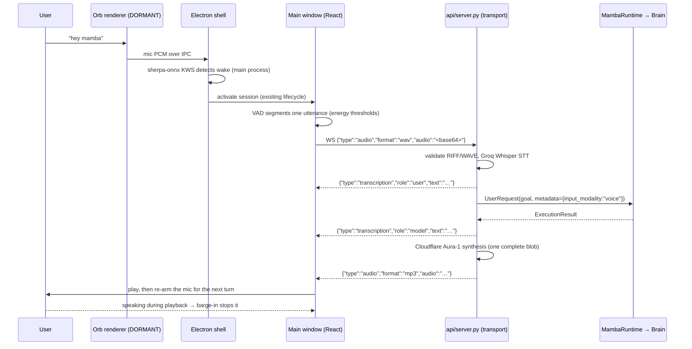

# Mamba Voice Interface Guide

Mamba has a native hands-free voice interface: **speech in → canonical Core execution →
speech out**, available from both the Python CLI and the desktop app. Both clients execute
through the identical `MambaRuntime` — voice is an input and output modality, never a second
brain.

> **Status:** the voice path is **IMPLEMENTED** end to end, including continuous
> conversation, client-side VAD, barge-in, and an **offline wake-word prototype**
> (**IMPLEMENTED** with stated limitations — §7). What is *not* implemented is called out in
> §9 rather than glossed over.

---

## 1. End-to-end flow (CLI)

```
Microphone (press Enter to start / stop)
  │ 16 kHz mono int16 → .wav
  ▼
STT — Groq hosted Whisper (voice/stt.py :: GroqSTTProvider)
  │ transcribed text
  ▼
MambaRuntime → Brain (intake → context → memory → planning → permission →
  │            execution → observation → verification → memory update)
  ▼
Response normalization (voice/normalization.py — strips markdown, code, tables)
  ▼
TTS — Cloudflare Workers AI Aura-1 (voice/tts.py :: CloudflareTTSProvider)
  │ audio blob
  ▼
Speaker playback (Windows MCI)
```

`VoiceInterface.process_voice_input()` is the single shared entry point used by the CLI loop,
`POST /api/voice`, and the `/live` WebSocket voice branch.

---

## 2. End-to-end flow (desktop)



Division of labour, stated plainly:

| Concern | Where it runs |
| :--- | :--- |
| Microphone capture, VAD, barge-in, playback | **Renderer** (`src/audio.ts`) |
| Wake-word spotting | **Electron main process** (`electron/wakeKws.cjs`) |
| Transcription, execution, synthesis | **Python backend** (`api/server.py` → `voice/` → `core/runtime.py`) |
| Planning, permissions, tools, verification | **Mamba Core** — identical to the text path |

There is no separate voice orchestrator, no voice-specific planner, and no client-side
inference except the pinned wake-word model.

---

## 3. Configuration & credentials

| Purpose | Provider | Env var | Default |
| :--- | :--- | :--- | :--- |
| Speech-to-text | Groq hosted Whisper | `GROQ_API_KEY` (required), `GROQ_STT_MODEL` | `whisper-large-v3-turbo` |
| Text-to-speech | Cloudflare Workers AI | `CLOUDFLARE_ACCOUNT_ID`, `CLOUDFLARE_API_TOKEN`, `CLOUDFLARE_TTS_MODEL` | `@cf/deepgram/aura-1` |

- Both use stdlib HTTP; STT posts multipart audio with a 30 s timeout, TTS posts the text and
  receives the whole audio blob.
- Missing keys produce a clear configuration error naming the exact variable. **Text mode is
  unaffected** — the desktop app works fully without voice credentials.
- If STT cannot be constructed at server start, voice degrades to text-only on the transport
  (`POST /api/voice` → HTTP 503; `/live` → `{"type":"error","error":"Voice is not configured on server."}`).

---

## 4. Starting voice mode

```powershell
python app.py --voice          # CLI voice loop
```
```text
mamba> voice                   # switch from the interactive text prompt
Switching to voice interface...
```

**Desktop:** click the Orb (or say **"hey mamba"** while dormant) to activate the session.
The main window then runs a continuous conversation until it is closed, the session is
stopped, or it idles out. Settings expose wake-word on/off (**on by default**), the phrase,
sensitivity, microphone choice, and voice id; a text-chat fallback panel covers machines with
no microphone.

---

## 5. The CLI voice loop

1. Press **`[Enter]`** to start recording.
2. Speak.
3. Press **`[Enter]`** to stop.
4. Mamba transcribes, executes through Core, prints the result, and speaks it.

Type `exit` or `text` to return to the text CLI. The CLI loop is **manual**: it has no VAD and
no barge-in — Enter starts and stops recording (`voice/audio.py`). Continuous, hands-free
conversation is a desktop-app capability.

---

## 6. Continuous conversation, VAD, and barge-in (desktop)

`MambaAudioSession.startContinuousSession()` acquires the microphone **once** and runs a
session loop: capture → endpoint → send → await the server turn → re-arm.

**Energy-based VAD** (implemented in the renderer, `src/audio.ts:40-58`):

| Constant | Value | Meaning |
| :--- | :--- | :--- |
| `VAD_START_THRESHOLD` | 0.02 RMS | speech begins |
| `VAD_END_THRESHOLD` | 0.012 RMS | below this… |
| `VAD_SILENCE_END_MS` | 1200 ms | …for this long → utterance endpoint |
| `VAD_MAX_TURN_MS` | 20 000 ms | hard cap on one turn |
| `CONTINUOUS_IDLE_TURNS` | 15 quiet cycles | session self-ends (~5 min of silence) so the mic is not held indefinitely |

**Barge-in** — while Mamba is speaking, sustained microphone energy stops playback and starts a
new turn:

| Constant | Value |
| :--- | :--- |
| `BARGE_IN_RMS_THRESHOLD` | 0.05 |
| `BARGE_IN_POLL_MS` | 100 |
| `BARGE_IN_STREAK` | 4 consecutive polls |
| `BARGE_IN_PLAYBACK_GRACE_MS` | 800 (ignore the start of playback) |
| `BARGE_IN_COOLDOWN_MS` | 2500 |

**Client state machine** (`LiveState`): `disconnected` → `connecting` → `idle` → `listening` →
`thinking` → `speaking` → `permission` → `error`. This is the same state vocabulary the Orb
renders (§16 of [ARCHITECTURE.md](ARCHITECTURE.md)), pushed to the shell over IPC.

**Audio never streams.** The TTS provider returns a complete blob and the client plays a
complete file; the transport comment in `api/server.py` calls this out explicitly — no partial
playback is faked.

**Transcripts** are rendered live: `transcription` messages carry `role: "user"` (partial and
final) and `role: "model"`, so what Mamba heard and what it decided to say are both visible.

---

## 7. Wake word — offline prototype, honestly scoped

| | |
| :--- | :--- |
| Engine | **sherpa-onnx** streaming Zipformer keyword spotting (`sherpa-onnx-kws-zipformer-gigaspeech-3.3M-2024-01-01`, int8) |
| Runtime | Electron **main process** (`electron/wakeKws.cjs`), WASM under Node |
| Why not the renderer | the WASM build requires Emscripten NODERAWFS, which cannot initialize in a `nodeIntegration: false` Chromium context |
| Capture | Orb renderer mic → 16 kHz PCM chunks over IPC (`mamba:wake-kws-audio`); detections return as `mamba:wake-kws-detected` and use the existing activation path |
| Phrase | **"hey mamba"** → keyword token sequence `▁HE Y ▁MA M B A` |
| Sensitivity | slider mapped to spotter thresholds `0.35 … 0.10` |
| Privacy | fully offline: nothing is recorded, persisted, or transmitted. The mic is released when the engine stops and the voice session takes over |
| Licensing | Apache-2.0 runtime and model; pinned artifacts documented in `public/wake/VERSIONS.md` |

**Limitations — these are real, and they are why the label says prototype:**

1. **Exactly one phrase.** Configuring any other phrase returns an explicit error rather than
   silently falling back — but only "hey mamba" works.
2. **One English spotting model** (GigaSpeech-derived). No other language, no speaker
   verification, no trained custom keyword.
3. **Not system-level.** It listens only while the Electron shell is running with the Orb
   alive; it is not an OS-wide always-on service.
4. **Accuracy and power are unmeasured.** No false-accept/false-reject rate and no DORMANT
   CPU budget have been established; a 15 MB WASM module plus a continuous mic pump is not free.
5. **Diagnostic instrumentation is still in the path** (`wakeDiag` / `TEMP DIAG` logging in
   the controller, engine, and shell).
6. `src/wake/webSpeechEngine.ts` (the earlier browser Web Speech API approach) is retained
   only as a retired stopgap and a compatibility shim (`src/wakeWord.ts`); it is not what runs.

---

## 8. Voice and permissions

Voice input reaches the same permission policy as text input — with one deliberate asymmetry.

```
 spoken request → Core → HIGH-risk step → ASK → pause
```

- The server sends `status: "permission"` plus a `permission_request`
  (`{command, reason}`) and synthesizes the announcement *"I need your confirmation on screen
  to proceed."*
- The user answers by **clicking** the `SudoPopup` (or by typing `yes`/`no`). The client
  delivers that as an ordinary `{type: "text", text: "yes" | "no"}` message — approval is
  typed input, not speech.
- **A spoken "yes" is refused.** Pending approvals are always HIGH-risk actions, and
  `input_modality: "voice"` requests cannot satisfy them: mis-transcription, background
  conversation, and a model that hears what it expects are all ways to destroy something the
  user did not mean to confirm. The pending approval **survives** a rejected voice approval, so
  the user can still confirm on screen afterwards.
- **A spoken "no" always works**, because cancelling is the safe direction.

Rationale in [SECURITY.md](SECURITY.md) §3 (invariant 11).

---

## 9. Graceful degradation and known gaps

**Degradation (implemented):**

| Condition | Behavior |
| :--- | :--- |
| TTS HTTP 429 / quota / "neurons" | TTS marked degraded **for the rest of the session**; execution continues and results stay in text; spoken text is capped at 800 chars with "… and more." |
| Empty / silent audio | Clean notification, no exception, session continues |
| Playback error | Absorbed; does not corrupt execution state |
| No STT credential on the server | `/api/voice` → 503, `/live` → explicit error message; text paths unaffected |
| No microphone | Text-chat fallback panel |

**Gaps (not implemented — do not describe as present):**

- **No VAD or barge-in in the Python/CLI path.** Energy-based segmentation exists only in the
  desktop renderer; the CLI loop is Enter-to-start/Enter-to-stop.
- **No server-side VAD.** The server trusts client endpoints; there is no interruption message
  from the server. The client's `{"type":"interrupted"}` handler is reserved for a future
  phase and the server never sends it.
- **Dead client message types.** Handlers for `toolCall`, `toolResponse`, `memory_sync`,
  `reminder`, and `terminal_output` exist in `src/audio.ts` but the transport emits none of
  them.
- **`VAD_MIN_AUDIO_MS` is declared but never enforced**, so a very short burst can still be
  sent as an utterance.
- **No wake word in the CLI**, and no wake word outside Electron (e.g. in a plain browser tab).
- **No streaming TTS/STT**, by design: the providers do not stream.

---

## Related documents

- [Architecture Specification](ARCHITECTURE.md) — §14 voice/text interfaces, §16 Orb, §20 React boundary, §21 transport
- [Security Model](SECURITY.md) — why voice cannot approve
- [Skills & Capabilities Reference](SKILLS.md) — what a voice turn can actually do
- [Long-Term Memory](MEMORY.md) — what a voice turn remembers
